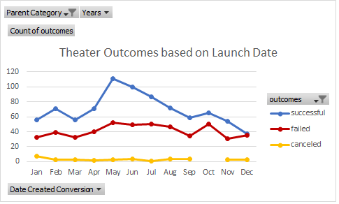
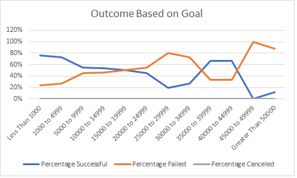

# Kickstarting with Excel

## Overview of Project
Louise is an up-and-coming playwrigth, she wants to start a crowdfunding campaign to fund her play ***Fever*** in the U.S., but is hestitant in jumping in without any analysis.

I have to use Excel to organize, sort and analyze a crowdfunding dataset **Kickstarter** to determine whether there are specific factors that make a campaign succesful. These insights will help Louise plan her own and set it up for success. 

### Purpose
The purpose of this analysis is help Louise kickstart her production. I will do this by sharing reports, charts and findings which will help her gain a greater understanding of campaigns from start to finish and will help her mirror successul ones in the same category. 

## Analysis and Challenges

### Past Analysis 
The analysis that I shared with her earlier showed that the category **Theatre** was the most frequent campaign in Kickstarters (almost 2 times as frequent as the 2nd most frequent category **Music**). 

We also discovered that within the category **Theater**, the most popular subcategory was **Plays** (almost 9 times more popular than the 2 other subcategories **Muscial** and **Spaces**). 

Furthermore, descriptive stastics of *Successful and Failed U.S. kickstarters* revaled that the mean of each distribution was around the 3rd quartile, so the data followed similar distributions in each subset. 

Based on her interest in researching musicals in Great Britain for a future project, I created a **Box and Whiskers Plot** for her. It showed us that the mean of the campaign goal is approx. £4,000. This is outside of the range of outliers for the pledged amounts, so Louise should probably try to get her play produced for less than £4,000. Half of the campaign goals are less than £2,000, which is just over the 3rd quartile for amounts pledged. ***So £2,000 might be a better campaign goal to consider*** for her future Great Britain campaigns.

### New Analysis (for Challange 1)
I then decided to give her further insights by digging deeper and performing an analysis based on two important factors
1) Outcomes based on Launch dates. 
2) Outcomes Based on Goals. 

### Analysis of Outcomes Based on Launch Date
To perform this Analysis, the following steps were performed 
1) A new column was created in the sheet **Kickstarter** and labeled **Years**.
2) In the **Years** column, the function `YEAR()` was used to extract the year from the **Date Created Conversion** column.
3) A new sheet was created and labeled **Theater Outcomes on Launch Data**.
4) A Pivot Table was created using the data on the **Kickstarter** sheet.
5) The Pivot table was filtered based on **Parent Category** and **Years**. 
6) The column labels were filtered to show only **successful**, **failed**, and **canceled**.
7) The **Row Labels** column was grouped to show the months of the year.
8) The **Parent Category** was filtered to show only the data for **theater**.
9) The campaign outcomes were sorted in descending order so **successful** was first.
10) A line chart was created from the pivot table to visualize the relationship between outcomes and launch month.

### Analysis outcome



### Analysis of Outcomes Based on Goals
To perform this Analysis, the following steps were performed
1) In the **KickStarter** sheet, a new sheet was created and labeled **Outcomes Based on Goals**.
2) In the new sheet, the following columns were created 
* Goal 
* Number Successful
* Number Failed
* Number Canceled
* Total Projects
* Percentage Successful
* Percentage Failed
* Percentage Canceled

3) In the **Goal** column, the following dollar-amount ranges were created
* Less Than 1000
* 1000 to 4999
* 5000 to 9999
* 10000 to 14999
* 15000 to 19999
* 20000 to 24999
* 25000 to 29999
* 30000 to 34999
* 35000 to 39999
* 40000 to 44999
* 45000 to 49999
* Greater Than 50000

4) The function `COUNTIFS()` was used to populate the **Number Successful**, **Number Failed**, and **Number Canceled** columns by filtering on the Kickstarter **outcome** column, on the **goal** amount column using the ranges created in Step 3, and on the **Subcategory** column using **plays** as the criteria.
5) The function `SUM()` was used to populate the **Total Projects** column with the number of successful, failed, and canceled projects for each row.
6) The percentage of successful, failed, and canceled projects was calculated for each row.
7) A line chart titled **Outcomes Based on Goal** was created to visualize the relationship between the goal-amount ranges on the x-axis and the percentage of successful, failed, or canceled projects on the y-axis.

### Analysis outcome



### Challenges and Difficulties Encountered

On part 2 of the assignment **Analysis based on Goals**. I missed reading a part of the # 3 instruction (I missed the part `"on the “Subcategory” column using “plays” as the criteria."`). My graph came totally different from what was expected. I spent 3 hours going through the table making sure that I have not missed any comma(s), did not make any referencing mistake(s). I recreated the table 2-3 times but to no avail. I finally decided to read the instrucions again, I discoved my mistake and corrected it. Result - the output matched with the desired output.

Learning - Instructions are to be read extra carefully, a small oversight can lead to hours of extra work, or worse not getting the result. As the proverb goes ***A Stitch in Time saves Nine.***

## Results

- What are two conclusions you can draw about the Outcomes based on Launch Date?
```This Analysis made us discover two important factors that can make or break the success of her campaign.
1) The best month to launch a campaign is May, follwed by June.
2) The worst month to launch a campaign is December. Jan, Mar, Apr and Nov are not good months either.
```

- What can you conclude about the Outcomes based on Goals?

```We can conclude that
1) The funding Goal of **Less than 1000** has the highest success rate at 76%, followed closely by the **1,000-5,000** funding goal, with a success rate at 73%.
2) Generally, as the Goal amount is incresed the success rate decreases, however, surprisingly the goal of **35,000 - 45,000** has a success rate of 67%
```
- What are some limitations of this dataset?
```Some limitations are
1) The data is old. Louise came to me in June 2020 for help. The data that I have is from 2014-2016. The more recent the data, the more relevant is the analysis.
2) It does not have data for unexpected situations like the COVID pandemic. In a unexceptional situation like this, I would not suggest Louise to start a campaign in June/July this year.
```
- What are some other possible tables and/or graphs that we could create?
```
Some othe things that we could have done
1) In the analysis of **Theater Outcomes based on Launch Date**, we used the count of *successful*, *failed* and *canceled* campaigns. We could use percentage insted - which would give us results showing the odds of succeding if starting a campaign in a particular month. 
2) Since Louise is interested in Plays, we could create a chart that show **Theater plays based on Launch Date**
3) We could do an analysis based on the length of campaigns.
4) We could use other charts like Bar charts, Box Plots, or Pie charts to look at the data from different angles.
```
